<!-- _class: lead -->
<!-- _paginate: false -->

# agentic-devcontainer

AI コーディングエージェントを
安全に実務投入するための開発環境テンプレート

社内説明会

---

## AI エージェントを実務に入れるときの 3 つの不安

1. **ローカル環境を直接触らせる怖さ**
   ファイル操作もコマンド実行も、開発者の PC 上でそのまま走る

2. **環境差異による属人化**
   セットアップ手順が人によって違い、「自分の環境では動く」が発生する

3. **認証情報の持ち出し**
   `.env` や API キーが、意図しない外部サービスに送られうる

---

## 解決: 隔離コンテナを標準の開発環境にする

エージェントが動く場所を、開発者の PC から**使い捨てのコンテナ**に移す。
そのうえで、コンテナに 3 つの制約をかける。

| | 何をするか |
| --- | --- |
| **隔離** | 作業は `/workspace` のみ。コンテナを捨てれば環境は元に戻る |
| **出口を絞る** | 許可した宛先以外への通信をネットワークレベルで遮断する |
| **事前検査** | エージェントが実行しようとするコマンドを、実行前に検査する |

---

## Before / After

| | 導入前 | 導入後 |
| --- | --- | --- |
| エージェントの実行場所 | 開発者の PC | 使い捨てコンテナ |
| 環境構築 | 各自が手順を追う | リポジトリを開くだけ |
| 通信先 | 制限なし | 許可リストの宛先のみ |
| 認証情報 | ファイルとして読める | 読み取りをツール側で拒否 |
| 事故ったとき | PC の状態を戻す作業が必要 | コンテナを作り直すだけ |

---

## 3 層の防御

**1. ネットワーク層** — `init-firewall.sh`
コンテナ起動時に `iptables` + `ipset` で、許可ドメイン以外への通信を破棄する。
許可されるのは、スクリプトに列挙された 13 ドメイン（Anthropic API、npm レジストリ、
VS Code、Context7、OpenAI API ほか）と、GitHub・Google が公開する IP レンジのみ。
ドメインの追加はスクリプトの編集が必要 = **レビューを通る**。

**2. シークレット層** — `.claude/settings.json`
`Read(**/.env)` と `Read(**/*.env)` を拒否。エージェントは `.env` をファイルとして読めない。

**3. 実行層** — `.claude/hooks/check-bash-command.sh`
`printenv` / 単独の `env` / `GH_TOKEN` / `.devcontainer/.env` を含むコマンドを、
実行される前にフックが検知して拒否する。

---

## 導入コスト

**必要なもの**
- Docker
- VS Code の Dev Containers 拡張

**手順**
- `README.md` の「使用方法」9 ステップ（テンプレートを新規リポジトリに反映 → コンテナで開く）

**リポジトリごとに設定するもの**
- `.devcontainer/.env`（Git ユーザー情報、GitHub トークン、API キー）
- `CLAUDE.md`（プロジェクト概要と作業ルール）
- 必要なら firewall の許可ドメイン追加

新しいツールの学習コストは発生しない。**普段どおり VS Code でリポジトリを開くだけ。**

---

## まとめ: 判断していただきたいこと

- AI エージェントの実務投入で問題になるのは、**性能ではなく実行環境の統制**
- このテンプレートは、隔離・通信制限・コマンド検査の 3 点をリポジトリに同梱する
- 導入コストは Docker と VS Code 拡張のみ。既存の開発フローは変えない

**→ 社内の標準開発環境として採用したい**

---

## 全体構成



---

## コンテナ起動時に走るもの



`devcontainer.json` の `postStartCommand` がこの順で実行される。
**firewall はブラウザ環境の準備後**に張られる。

---

## 導入手順

```bash
# 1. GitHub で新規リポジトリを作成しておく

# 2-5. テンプレートを新規リポジトリに反映する
git clone --bare https://github.com/Knu334/ClaudeCodeDevContainer.git
cd ClaudeCodeDevContainer.git
git push --mirror <新規リポジトリの URL>
cd .. && rm -rf ClaudeCodeDevContainer.git

# 6. 新規リポジトリをクローンする
git clone <新規リポジトリの URL>
```

7. VS Code でローカルリポジトリを開く
8. **コンテナーで現在のフォルダを開く** を実行する
9. ターミナルを開くと Claude Code が使える

---

## 最初に直す 3 箇所

**1. `.devcontainer/.env`** — `.env.sample` をコピーして作る

| 変数 | 内容 |
| --- | --- |
| `GIT_USER_NAME` / `GIT_USER_EMAIL` | コミットに使う Git ユーザー情報 |
| `GH_TOKEN` | GitHub Personal Access Token |
| `TZ` | タイムゾーン。デフォルトは `Asia/Tokyo` |
| `IMAGEARCH` | Mac は `arm64v8/`、Windows は `amd64/` |
| `CONTEXT7_API_KEY` | Context7 を使う場合 |
| `ANTHROPIC_BASE_URL` / `ANTHROPIC_API_KEY` | プロキシ経由で使う場合 |

**2. `CLAUDE.md`** — プロジェクト概要と作業ルールを書く
`AGENTS.md` はこのファイルへのシンボリックリンク。Codex CLI も同じ内容を読む。

**3. `.devcontainer/init-firewall.sh`** — 通信したい宛先があれば許可ドメインに追加する

---

## 日常の使い方

**Claude Code / Codex CLI**
どちらもターミナルからそのまま使える。設定は名前付き volume に永続化されるため、
コンテナを作り直しても認証やセッションは残る。

**Context7 でドキュメントを引く**
ライブラリやフレームワークの最新ドキュメントを取得する。
学習データが古い場合の誤りを防げるため、API の書き方を聞くときは常に経由させる。

**Playwright CLI**
ブラウザ操作の自動化と、Web ページの動作確認に使う。Chromium は導入済み。

---

## Git 運用ルール

- 必ず **`feature-<概要>` ブランチ**を作成し、**PR を発行する**
- Git / GitHub 操作は **`gh` CLI** を使う
- **`git push --force` と `git reset --hard` は禁止**

これらは `CLAUDE.md` に書かれており、エージェントもこのルールに従って動く。
ルールを変えたいときは `CLAUDE.md` を直す。

---

<!-- _class: compact -->

## つまずきポイント

**1. 通信が firewall で落ちる（最頻出）**

`npm install` や `curl` が理由不明で失敗したら、まず firewall を疑う。
症状はタイムアウトや接続拒否として出るため、原因が分かりにくい。

```bash
# 許可ドメインの一覧を確認する
grep -A 20 "for domain in" .devcontainer/init-firewall.sh
```

GitHub と Google はこのリストには出てきません。スクリプト前半で IP レンジごと許可されています。

対処: `init-firewall.sh` の `# Resolve and add other allowed domains` セクションに
ドメインを追加し、**コンテナをリビルドする**（起動時にしか適用されない）。

**2. `.env` が無くて起動に失敗する**
`.devcontainer/.env.sample` をコピーして `.env` を作る。`.env` はコミットされない。

**3. 設定が消えたように見える**
Claude Code / Codex の設定は名前付き volume にある。
volume を削除しない限り、コンテナを作り直しても残る。

---

## テンプレートの更新を取り込む

```bash
# 初回のみ: テンプレートをリモートに追加する
git remote add template https://github.com/Knu334/ClaudeCodeDevContainer.git

# 更新のたびに
git fetch --all
git merge template/main
# 競合が出たら解消する
git push
```

`init-firewall.sh` の許可ドメインを自分で追加していると、ここで競合しやすい。
**両方の変更を残す**方向で解消する。

---

<!-- _class: lead -->

## 次のアクション

**1.** 自分の担当リポジトリに、このテンプレートを導入する

**2.** `.devcontainer/.env` を作り、`CLAUDE.md` にプロジェクト概要を書く

**3.** 通信が必要な宛先があれば、firewall の許可ドメイン追加を PR で出す

質問・詰まった箇所は共有してください
