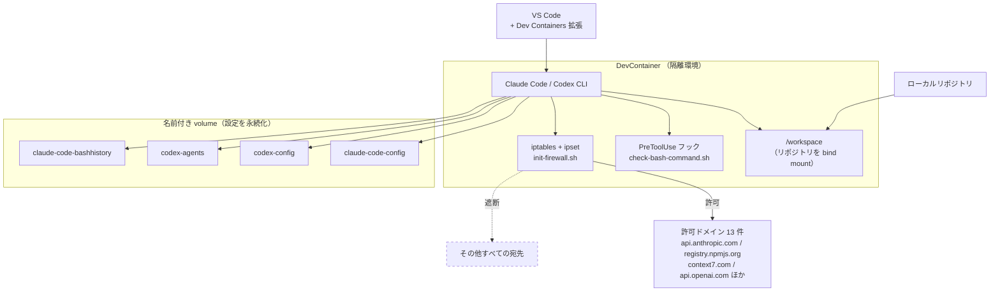
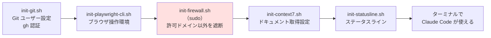

# agentic-devcontainer 説明資料 実装計画

> **For agentic workers:** REQUIRED SUB-SKILL: Use superpowers:subagent-driven-development (recommended) or superpowers:executing-plans to implement this plan task-by-task. Steps use checkbox (`- [ ]`) syntax for tracking.

**Goal:** 社内説明会（意思決定者とチームメンバーが同席、25〜30 分）で使う agentic-devcontainer の説明スライド 16 枚を Marp で作成し、HTML / PDF / PPTX に出力できる状態にする。

**Architecture:** `docs/slides/` 配下に Marp の Markdown 1 本を置き、図は Mermaid ソース（`.mmd`）を正として `mmdc` で SVG に変換して埋め込む。`build.sh` が「Chromium パス解決 → Mermaid 変換 → Marp 変換」を一気通貫で実行する。ビルド出力は `docs/slides/dist/` に置き、コミットしない。

**Tech Stack:** Marp CLI (`@marp-team/marp-cli`)、Mermaid CLI (`@mermaid-js/mermaid-cli`)、Playwright 同梱の Chromium、Bash

**設計書:** `docs/superpowers/specs/2026-08-07-project-overview-slides-design.md`

## Global Constraints

- **`package.json` を作らない。** 依存は `npx -y` で都度解決する。このリポジトリは Node プロジェクトではない。
- **Chromium のパスにバージョン番号（`chromium-1237` 等）を直書きしない。** `find` で解決する。
- **`build.sh` は実行ディレクトリに依存しない。** `BASH_SOURCE` からスクリプト自身の位置を解決する。
- **日本語フォントは `IPAGothic`。** コンテナに導入済みのものはこれのみ。`theme.css` で明示指定する。
- **コミットするのは `.mmd` と `.svg` まで。** `.html` / `.pdf` / `.pptx` はコミットしない。
- **外部 CDN に依存しない。** firewall で遮断されるため、フォントも図もローカル完結させる。
- **資料に書く事実は必ずコードを参照する。** 記憶や推測で書かない。Task 5 の事実整合チェックで照合する。
- ブランチは `feature-project-overview-slides`（作成済み・チェックアウト済み）。`git push --force` と `git reset --hard` は禁止。

---

## File Structure

| ファイル | 責務 |
| --- | --- |
| `docs/slides/agentic-devcontainer.md` | スライド本体。唯一の編集対象。16 枚 |
| `docs/slides/theme.css` | 日本語フォント指定と配色。Marp カスタムテーマ |
| `docs/slides/build.sh` | Chromium 解決 → Mermaid 変換 → Marp 変換の実行 |
| `docs/slides/diagrams/architecture.mmd` | 全体構成図の Mermaid ソース |
| `docs/slides/diagrams/boot-sequence.mmd` | 起動シーケンス図の Mermaid ソース |
| `docs/slides/assets/architecture.svg` | 上記の生成物。コミットする |
| `docs/slides/assets/boot-sequence.svg` | 上記の生成物。コミットする |
| `docs/slides/dist/` | HTML / PDF / PPTX の出力先。コミットしない |

### 設計書からの逸脱 1 点

設計書には「`.html` / `.pdf` / `.pptx` を `.gitignore` に追加する」と書いたが、**`.gitignore` は変更しない。**
既存の `.gitignore` に `dist/` ルールが存在し、出力先を `docs/slides/dist/` にすることで既にカバーされるため。
冗長なルールを足さず、Task 1 の検証手順で `git status` に出力物が現れないことを実際に確認する。

---

## Task 1: ビルド基盤とスケルトン

Marp のビルドが通る最小構成を先に作り、ツールチェーンが動くことを確定させる。スライド本文は後続タスクで足す。

**Files:**
- Create: `docs/slides/theme.css`
- Create: `docs/slides/agentic-devcontainer.md`（タイトル 1 枚のみ）
- Create: `docs/slides/build.sh`

**Interfaces:**
- Consumes: なし（最初のタスク）
- Produces:
  - `docs/slides/build.sh` — 引数なしで実行。`docs/slides/dist/agentic-devcontainer.{html,pdf,pptx}` を生成する。Task 2 でこのスクリプトに Mermaid 変換ステップを追加する。
  - `docs/slides/theme.css` — Marp テーマ名 `agentic`。`build.sh` が `--theme` で読み込む。
  - `docs/slides/agentic-devcontainer.md` — Task 3 / Task 4 がこのファイルにスライドを追記する。

---

- [ ] **Step 1: テーマ CSS を作成する**

`docs/slides/theme.css` を作成:

```css
/* @theme agentic */
@import 'default';

section {
  font-family: "IPAGothic", "IPA Pゴシック", sans-serif;
  font-size: 26px;
  padding: 60px;
  color: #24292f;
}

section h1 {
  color: #1f3a5f;
}

section h2 {
  color: #1f3a5f;
  border-bottom: 3px solid #1f3a5f;
  padding-bottom: 0.2em;
}

section.lead {
  text-align: center;
  justify-content: center;
}

section table {
  font-size: 0.8em;
}

section code {
  font-family: "DejaVu Sans Mono", monospace;
  background: #f2f4f7;
}

section strong {
  color: #b3261e;
}
```

- [ ] **Step 2: スケルトンのスライドを作成する**

`docs/slides/agentic-devcontainer.md` を作成:

```markdown
---
marp: true
paginate: true
---

<!-- _class: lead -->
<!-- _paginate: false -->

# agentic-devcontainer

AI コーディングエージェントを
安全に実務投入するための開発環境テンプレート

社内説明会
```

- [ ] **Step 3: ビルドスクリプトを作成する**

`docs/slides/build.sh` を作成:

```bash
#!/usr/bin/env bash
set -euo pipefail

SLIDE_DIR="$(cd "$(dirname "${BASH_SOURCE[0]}")" && pwd)"
SRC="$SLIDE_DIR/agentic-devcontainer.md"
THEME="$SLIDE_DIR/theme.css"
OUT_DIR="$SLIDE_DIR/dist"
BASENAME="agentic-devcontainer"

# Playwright 同梱の Chromium を解決する（パスにバージョン番号を直書きしない）
CHROME_BIN="$(find "$HOME/.cache/ms-playwright" -type f -name chrome -perm -u+x 2>/dev/null | head -n 1)"
if [ -z "$CHROME_BIN" ]; then
  echo "エラー: Playwright の Chromium が見つかりません。" >&2
  echo "  npx playwright install chromium を実行してください。" >&2
  exit 1
fi
echo "==> Chromium: $CHROME_BIN"

mkdir -p "$OUT_DIR"

echo "==> スライドを変換中 (HTML)"
CHROME_PATH="$CHROME_BIN" npx -y @marp-team/marp-cli@latest \
  "$SRC" --theme "$THEME" --allow-local-files -o "$OUT_DIR/$BASENAME.html"

echo "==> スライドを変換中 (PDF)"
CHROME_PATH="$CHROME_BIN" npx -y @marp-team/marp-cli@latest \
  "$SRC" --theme "$THEME" --allow-local-files -o "$OUT_DIR/$BASENAME.pdf"

echo "==> スライドを変換中 (PPTX)"
CHROME_PATH="$CHROME_BIN" npx -y @marp-team/marp-cli@latest \
  "$SRC" --theme "$THEME" --allow-local-files -o "$OUT_DIR/$BASENAME.pptx"

echo "==> 完了: $OUT_DIR"
ls -1 "$OUT_DIR"
```

- [ ] **Step 4: 実行権限を付与してビルドする**

```bash
chmod +x docs/slides/build.sh
./docs/slides/build.sh
```

期待: エラーなく終了し、最後に `agentic-devcontainer.html` / `.pdf` / `.pptx` の 3 ファイルが表示される。

失敗した場合の切り分け:
- `Chromium が見つかりません` → `ls ~/.cache/ms-playwright` で確認
- npm のダウンロードで止まる → firewall は `registry.npmjs.org` を許可済み。ネットワーク以外の原因を疑う

- [ ] **Step 5: 出力物がバージョン管理外であることを確認する**

```bash
git status --short
```

期待: `docs/slides/dist/` 配下のファイルが**一切現れない**（既存の `.gitignore` の `dist/` ルールで無視される）。
現れた場合は `.gitignore` に `docs/slides/dist/` を追記する。

- [ ] **Step 6: 日本語が文字化けしないことを目視確認する**

```bash
CHROME_BIN="$(find "$HOME/.cache/ms-playwright" -type f -name chrome -perm -u+x | head -n 1)"
CHROME_PATH="$CHROME_BIN" npx -y @marp-team/marp-cli@latest \
  docs/slides/agentic-devcontainer.md --theme docs/slides/theme.css \
  --images png -o docs/slides/dist/check.png
```

生成された PNG を Read ツールで開いて確認する。
期待: 「agentic-devcontainer」のタイトルと日本語本文が表示され、**豆腐（□）になっていない**。

- [ ] **Step 7: コミットする**

```bash
git add docs/slides/theme.css docs/slides/agentic-devcontainer.md docs/slides/build.sh
git commit -m "feat(slides): add Marp build pipeline and slide skeleton"
```

---

## Task 2: 図の生成

Mermaid ソースから SVG を生成する経路を `build.sh` に組み込み、2 枚の図を作る。

**Files:**
- Create: `docs/slides/diagrams/architecture.mmd`
- Create: `docs/slides/diagrams/boot-sequence.mmd`
- Modify: `docs/slides/build.sh`（Marp 変換の直前に Mermaid 変換ステップを挿入）
- 生成物: `docs/slides/assets/architecture.svg`, `docs/slides/assets/boot-sequence.svg`

**Interfaces:**
- Consumes: Task 1 の `docs/slides/build.sh`（`SLIDE_DIR` / `CHROME_BIN` 変数を再利用する）
- Produces:
  - `docs/slides/assets/architecture.svg` — Task 4 のスライド 8 が `` で参照する
  - `docs/slides/assets/boot-sequence.svg` — Task 4 のスライド 9 が `` で参照する

---

- [ ] **Step 1: 全体構成図の Mermaid ソースを作成する**

`docs/slides/diagrams/architecture.mmd` を作成:



- [ ] **Step 2: 起動シーケンス図の Mermaid ソースを作成する**

`docs/slides/diagrams/boot-sequence.mmd` を作成:



- [ ] **Step 3: build.sh に Mermaid 変換ステップを追加する**

`docs/slides/build.sh` の `mkdir -p "$OUT_DIR"` の直後に、以下を挿入する（`echo "==> スライドを変換中 (HTML)"` の前）:

```bash
mkdir -p "$SLIDE_DIR/assets"

# mmdc に既存 Chromium を使わせるための設定を一時ファイルとして生成する
TMP_DIR="$(mktemp -d)"
trap 'rm -rf "$TMP_DIR"' EXIT
printf '{"executablePath":"%s","args":["--no-sandbox"]}' "$CHROME_BIN" > "$TMP_DIR/puppeteer.json"

for mmd in "$SLIDE_DIR"/diagrams/*.mmd; do
  name="$(basename "$mmd" .mmd)"
  echo "==> 図を生成中: $name.svg"
  npx -y @mermaid-js/mermaid-cli@latest \
    --puppeteerConfigFile "$TMP_DIR/puppeteer.json" \
    -i "$mmd" -o "$SLIDE_DIR/assets/$name.svg" \
    -b transparent
done
```

- [ ] **Step 4: ビルドして SVG が生成されることを確認する**

```bash
./docs/slides/build.sh
ls -l docs/slides/assets/
```

期待: `architecture.svg` と `boot-sequence.svg` が存在し、いずれもサイズが 0 でない。

失敗した場合の切り分け:
- `Failed to launch the browser process` → `puppeteer.json` の `--no-sandbox` が効いているか確認
- Mermaid の構文エラー → エラーメッセージが示す行番号の `.mmd` を修正

- [ ] **Step 5: SVG に日本語が埋め込まれていることを確認する**

```bash
grep -c "コンテナ\|遮断" docs/slides/assets/architecture.svg
grep -c "許可ドメイン\|ステータスライン" docs/slides/assets/boot-sequence.svg
```

期待: いずれも 1 以上。0 の場合はテキストが画像化されているか描画に失敗している。

- [ ] **Step 6: 図を目視確認する**

生成された SVG を Read ツールで開くか、以下で PNG 化して確認する:

```bash
CHROME_BIN="$(find "$HOME/.cache/ms-playwright" -type f -name chrome -perm -u+x | head -n 1)"
printf '{"executablePath":"%s","args":["--no-sandbox"]}' "$CHROME_BIN" > /tmp/pp.json
npx -y @mermaid-js/mermaid-cli@latest --puppeteerConfigFile /tmp/pp.json \
  -i docs/slides/diagrams/architecture.mmd -o /tmp/architecture.png -w 1400
```

期待: ノードが重ならず、日本語が文字化けせず、遮断の線が破線で表現されている。

- [ ] **Step 7: コミットする**

```bash
git add docs/slides/build.sh docs/slides/diagrams docs/slides/assets
git commit -m "feat(slides): generate architecture and boot sequence diagrams"
```

---

## Task 3: 前半スライド（1〜7 枚目・意思決定者向け）

「なぜ必要か」を前半だけで完結させる。途中退席しても GO 判断ができる状態にする。

**Files:**
- Modify: `docs/slides/agentic-devcontainer.md`（Task 1 のタイトルスライドの後ろに 6 枚を追記）

**Interfaces:**
- Consumes: Task 1 の `docs/slides/agentic-devcontainer.md` と `build.sh`
- Produces: スライド 1〜7。Task 4 がこのファイルの末尾にスライド 8 以降を追記する。

**このタスクで使う事実（コードから確認済み・改変しないこと）:**
- firewall の許可ドメインは 13 件（`.devcontainer/init-firewall.sh`）
- `.claude/settings.json` の `permissions.deny` は `Read(**/.env)` と `Read(**/*.env)`
- `check-bash-command.sh` は `printenv` / 単独の `env` / `GH_TOKEN` / `.devcontainer/.env` を含むコマンドを実行前に拒否する
- `docker-compose.yml` の `cap_add` は `NET_ADMIN` と `NET_RAW`
- `README.md` の「使用方法」は 9 ステップ

---

- [ ] **Step 1: スライド 2〜4 を追記する**

`docs/slides/agentic-devcontainer.md` の末尾に追記:

```markdown
---

## AI エージェントを実務に入れるときの 3 つの不安

1. **ローカル環境を直接触らせる怖さ**
   ファイル操作もコマンド実行も、開発者の PC 上でそのまま走る

2. **環境差異による属人化**
   セットアップ手順が人によって違い、「自分の環境では動く」が発生する

3. **認証情報の持ち出し**
   `.env` や API キーが、意図しない外部サービスに送られうる

---

## 解決: 隔離コンテナを標準の開発環境にする

エージェントが動く場所を、開発者の PC から**使い捨てのコンテナ**に移す。
そのうえで、コンテナに 3 つの制約をかける。

| | 何をするか |
| --- | --- |
| **隔離** | 作業は `/workspace` のみ。コンテナを捨てれば環境は元に戻る |
| **出口を絞る** | 許可した宛先以外への通信をネットワークレベルで遮断する |
| **事前検査** | エージェントが実行しようとするコマンドを、実行前に検査する |

---

## Before / After

| | 導入前 | 導入後 |
| --- | --- | --- |
| エージェントの実行場所 | 開発者の PC | 使い捨てコンテナ |
| 環境構築 | 各自が手順を追う | リポジトリを開くだけ |
| 通信先 | 制限なし | 許可した 13 ドメインのみ |
| 認証情報 | ファイルとして読める | 読み取りをツール側で拒否 |
| 事故ったとき | PC の状態を戻す作業が必要 | コンテナを作り直すだけ |
```

- [ ] **Step 2: スライド 5〜7 を追記する**

続けて末尾に追記:

```markdown
---

## 3 層の防御

**1. ネットワーク層** — `init-firewall.sh`
コンテナ起動時に `iptables` + `ipset` で、許可ドメイン以外への通信を破棄する。
許可は 13 件のみ（Anthropic API、npm レジストリ、GitHub、VS Code、Context7、OpenAI API ほか）。
ドメインの追加はスクリプトの編集が必要 = **レビューを通る**。

**2. シークレット層** — `.claude/settings.json`
`Read(**/.env)` と `Read(**/*.env)` を拒否。エージェントは `.env` をファイルとして読めない。

**3. 実行層** — `.claude/hooks/check-bash-command.sh`
`printenv` / `env` / `GH_TOKEN` / `.devcontainer/.env` を含むコマンドを、
実行される前にフックが検知して拒否する。

---

## 導入コスト

**必要なもの**
- Docker
- VS Code の Dev Containers 拡張

**手順**
- `README.md` の「使用方法」9 ステップ（テンプレートを新規リポジトリに反映 → コンテナで開く）

**リポジトリごとに設定するもの**
- `.devcontainer/.env`（Git ユーザー情報、GitHub トークン、API キー）
- `CLAUDE.md`（プロジェクト概要と作業ルール）
- 必要なら firewall の許可ドメイン追加

新しいツールの学習コストは発生しない。**普段どおり VS Code でリポジトリを開くだけ。**

---

## まとめ: 判断していただきたいこと

- AI エージェントの実務投入で問題になるのは、**性能ではなく実行環境の統制**
- このテンプレートは、隔離・通信制限・コマンド検査の 3 点をリポジトリに同梱する
- 導入コストは Docker と VS Code 拡張のみ。既存の開発フローは変えない

**→ 社内の標準開発環境として採用したい**
```

- [ ] **Step 3: ビルドして 7 枚になっていることを確認する**

```bash
./docs/slides/build.sh
```

期待: エラーなく完了する。

- [ ] **Step 4: 全ページを PNG で目視確認する**

```bash
CHROME_BIN="$(find "$HOME/.cache/ms-playwright" -type f -name chrome -perm -u+x | head -n 1)"
CHROME_PATH="$CHROME_BIN" npx -y @marp-team/marp-cli@latest \
  docs/slides/agentic-devcontainer.md --theme docs/slides/theme.css \
  --allow-local-files --images png -o docs/slides/dist/p.png
ls -1 docs/slides/dist/*.png
```

期待: PNG が 7 枚生成される。各ページを Read ツールで開き、以下を確認する:
- 文字がスライド枠からはみ出していない
- 表が途中で切れていない
- 日本語が豆腐になっていない

はみ出す場合は `theme.css` の `font-size` を下げるか、該当スライドに `<!-- _class: small -->` 用のクラスを追加する。

- [ ] **Step 5: コミットする**

```bash
git add docs/slides/agentic-devcontainer.md
git commit -m "docs(slides): add decision-maker section (slides 1-7)"
```

---

## Task 4: 後半スライド（8〜16 枚目・メンバー向け）

「どう使うか」を扱う。Task 2 で生成した図を埋め込む。

**Files:**
- Modify: `docs/slides/agentic-devcontainer.md`（末尾に 9 枚を追記）

**Interfaces:**
- Consumes:
  - Task 2 の `docs/slides/assets/architecture.svg` と `docs/slides/assets/boot-sequence.svg`
  - Task 3 までの `docs/slides/agentic-devcontainer.md`
- Produces: 全 16 枚のスライド。Task 5 が通し検証する。

**このタスクで使う事実（コードから確認済み・改変しないこと）:**
- `postStartCommand` の実行順: `init-git.sh` → `init-playwright-cli.sh` → `sudo init-firewall.sh` → `init-context7.sh` → `init-statusline.sh`（`.devcontainer/devcontainer.json`）
- 名前付き volume: `claude-code-bashhistory`（`/commandhistory`）、`claude-code-config`（`/home/node/.claude`）、`codex-config`（`/home/node/.codex`）、`codex-agents`（`/home/node/.agents`）
- `.env.sample` の項目: `GIT_USER_EMAIL`, `GIT_USER_NAME`, `GH_TOKEN`, `TZ`, `IMAGEARCH`, `CONTEXT7_API_KEY`, `ANTHROPIC_BASE_URL`, `ANTHROPIC_API_KEY`
- `IMAGEARCH` は Mac が `arm64v8/`、Windows が `amd64/`
- `CLAUDE.md` のルール: `feature-<概要>` ブランチを作成し PR を発行、`gh` CLI を使用、`git push --force` / `git reset --hard` 禁止
- `AGENTS.md` は `CLAUDE.md` へのシンボリックリンク（Codex CLI も同じ内容を参照する）

---

- [ ] **Step 1: スライド 8〜10 を追記する**

`docs/slides/agentic-devcontainer.md` の末尾に追記:

```markdown
---

## 全体構成


---

## コンテナ起動時に走るもの


`devcontainer.json` の `postStartCommand` がこの順で実行される。
**firewall はブラウザ環境の準備後**に張られる。

---

## 導入手順

```bash
# 1. GitHub で新規リポジトリを作成しておく

# 2-5. テンプレートを新規リポジトリに反映する
git clone --bare https://github.com/Knu334/ClaudeCodeDevContainer.git
cd ClaudeCodeDevContainer.git
git push --mirror <新規リポジトリの URL>
cd .. && rm -rf ClaudeCodeDevContainer.git

# 6. 新規リポジトリをクローンする
git clone <新規リポジトリの URL>
```

7. VS Code でローカルリポジトリを開く
8. **コンテナーで現在のフォルダを開く** を実行する
9. ターミナルを開くと Claude Code が使える
```

- [ ] **Step 2: スライド 11〜13 を追記する**

続けて末尾に追記:

```markdown
---

## 最初に直す 3 箇所

**1. `.devcontainer/.env`** — `.env.sample` をコピーして作る

| 変数 | 内容 |
| --- | --- |
| `GIT_USER_NAME` / `GIT_USER_EMAIL` | コミットに使う Git ユーザー情報 |
| `GH_TOKEN` | GitHub Personal Access Token |
| `IMAGEARCH` | Mac は `arm64v8/`、Windows は `amd64/` |
| `CONTEXT7_API_KEY` | Context7 を使う場合 |
| `ANTHROPIC_BASE_URL` / `ANTHROPIC_API_KEY` | プロキシ経由で使う場合 |

**2. `CLAUDE.md`** — プロジェクト概要と作業ルールを書く
`AGENTS.md` はこのファイルへのシンボリックリンク。Codex CLI も同じ内容を読む。

**3. `.devcontainer/init-firewall.sh`** — 通信したい宛先があれば許可ドメインに追加する

---

## 日常の使い方

**Claude Code / Codex CLI**
どちらもターミナルからそのまま使える。設定は名前付き volume に永続化されるため、
コンテナを作り直しても認証やセッションは残る。

**Context7 でドキュメントを引く**
ライブラリやフレームワークの最新ドキュメントを取得する。
学習データが古い場合の誤りを防げるため、API の書き方を聞くときは常に経由させる。

**Playwright CLI**
ブラウザ操作の自動化と、Web ページの動作確認に使う。Chromium は導入済み。

---

## Git 運用ルール

- 必ず **`feature-<概要>` ブランチ**を作成し、**PR を発行する**
- Git / GitHub 操作は **`gh` CLI** を使う
- **`git push --force` と `git reset --hard` は禁止**

これらは `CLAUDE.md` に書かれており、エージェントもこのルールに従って動く。
ルールを変えたいときは `CLAUDE.md` を直す。
```

- [ ] **Step 3: スライド 14〜16 を追記する**

続けて末尾に追記:

```markdown
---

## つまずきポイント

**1. 通信が firewall で落ちる（最頻出）**

`npm install` や `curl` が理由不明で失敗したら、まず firewall を疑う。
症状はタイムアウトや接続拒否として出るため、原因が分かりにくい。

```bash
# 許可ドメインの一覧を確認する
grep -A 20 "for domain in" .devcontainer/init-firewall.sh
```

対処: `init-firewall.sh` の `# Resolve and add other allowed domains` セクションに
ドメインを追加し、**コンテナをリビルドする**（起動時にしか適用されない）。

**2. `.env` が無くて起動に失敗する**
`.devcontainer/.env.sample` をコピーして `.env` を作る。`.env` はコミットされない。

**3. 設定が消えたように見える**
Claude Code / Codex の設定は名前付き volume にある。
volume を削除しない限り、コンテナを作り直しても残る。

---

## テンプレートの更新を取り込む

```bash
# 初回のみ: テンプレートをリモートに追加する
git remote add template https://github.com/Knu334/ClaudeCodeDevContainer.git

# 更新のたびに
git fetch --all
git merge template/main
# 競合が出たら解消する
git push
```

`init-firewall.sh` の許可ドメインを自分で追加していると、ここで競合しやすい。
**両方の変更を残す**方向で解消する。

---

<!-- _class: lead -->

## 次のアクション

**1.** 自分の担当リポジトリに、このテンプレートを導入する

**2.** `.devcontainer/.env` を作り、`CLAUDE.md` にプロジェクト概要を書く

**3.** 通信が必要な宛先があれば、firewall の許可ドメイン追加を PR で出す

質問・詰まった箇所は共有してください
```

- [ ] **Step 4: ビルドして図が埋め込まれることを確認する**

```bash
./docs/slides/build.sh
```

期待: エラーなく完了する。`--allow-local-files` が付いているため、PDF / PPTX にもローカル SVG が埋め込まれる。

失敗した場合: `Cannot load local file` が出たら `build.sh` の各 marp 呼び出しに `--allow-local-files` があるか確認する。

- [ ] **Step 5: 全 16 ページを PNG で目視確認する**

```bash
rm -f docs/slides/dist/*.png
CHROME_BIN="$(find "$HOME/.cache/ms-playwright" -type f -name chrome -perm -u+x | head -n 1)"
CHROME_PATH="$CHROME_BIN" npx -y @marp-team/marp-cli@latest \
  docs/slides/agentic-devcontainer.md --theme docs/slides/theme.css \
  --allow-local-files --images png -o docs/slides/dist/p.png
ls -1 docs/slides/dist/*.png | wc -l
```

期待: 16。各ページを Read ツールで開き、以下を確認する:
- **8 枚目と 9 枚目に図が表示されている**（空白や壊れた画像アイコンになっていない）
- 図がスライド枠に収まり、文字が読める大きさである
- コードブロックが横にはみ出していない
- 日本語が豆腐になっていない

図が大きすぎる／小さすぎる場合は `![width:900px]` の数値を調整する。

- [ ] **Step 6: コミットする**

```bash
git add docs/slides/agentic-devcontainer.md
git commit -m "docs(slides): add developer section (slides 8-16)"
```

---

## Task 5: 通し検証と事実整合チェック

資料の記述が実際のコードと一致することを照合し、PR を発行する。

**Files:**
- Modify: `docs/slides/agentic-devcontainer.md`（照合で見つかった誤りがあれば修正）

**Interfaces:**
- Consumes: Task 4 までの全成果物
- Produces: レビュー可能な PR

---

- [ ] **Step 1: 許可ドメインの記述を照合する**

```bash
grep -A 15 "for domain in" .devcontainer/init-firewall.sh
```

期待される 13 件: `registry.npmjs.org`, `api.anthropic.com`, `marketplace.visualstudio.com`, `vscode.blob.core.windows.net`, `update.code.visualstudio.com`, `context7.com`, `api.openai.com`, `developers.openai.com`, `auth.openai.com`, `auth0.openai.com`, `chatgpt.com`, `sdmntprnorthcentralus.oaiusercontent.com`, `proxy.bar504.net`

スライド 4・5・8 に書いた「13 ドメイン」という件数と、図に列挙したドメイン名が一致するか確認する。
**件数が変わっていたらスライドと `architecture.mmd` の両方を直し、図を再生成する。**

- [ ] **Step 2: 起動順を照合する**

```bash
grep "postStartCommand" .devcontainer/devcontainer.json
```

期待: `init-git.sh` → `init-playwright-cli.sh` → `sudo init-firewall.sh` → `init-context7.sh` → `init-statusline.sh`

スライド 9 の図（`boot-sequence.mmd`）の順序と一致するか確認する。

- [ ] **Step 3: volume と環境変数を照合する**

```bash
sed -n '/volumes:/,/networks:/p' .devcontainer/docker-compose.yml
cat .devcontainer/.env.sample
```

スライド 8（図）の volume 名 4 件と、スライド 11 の環境変数一覧が一致するか確認する。

- [ ] **Step 4: セキュリティ設定を照合する**

```bash
cat .claude/settings.json
cat .claude/hooks/check-bash-command.sh
```

スライド 5 の記述と一致するか確認する:
- `permissions.deny` は `Read(**/.env)` と `Read(**/*.env)` の 2 件
- フックが拒否するパターンは `printenv` / 単独の `env` / `GH_TOKEN` / `.devcontainer/.env`

- [ ] **Step 5: 導入手順と Git ルールを照合する**

```bash
sed -n '/## 使用方法/,/## テンプレート/p' README.md
sed -n '/GitHub ワークフロー/,$p' CLAUDE.md
```

スライド 6（9 ステップ）、スライド 10（導入手順）、スライド 13（Git ルール）、スライド 15（更新取り込み）と一致するか確認する。

**既知の不整合:** `README.md` は `OPENAI_API_KEY` を設定項目として挙げているが、`.env.sample` には存在しない。
**スライドには `.env.sample` の実際の内容（`OPENAI_API_KEY` を含めない）を書くこと。**
README の修正は今回のスコープ外だが、PR 本文に申し送りとして記載する。

- [ ] **Step 6: 最終ビルドを通す**

```bash
./docs/slides/build.sh
ls -l docs/slides/dist/
git status --short
```

期待:
- HTML / PDF / PPTX の 3 ファイルが生成される
- `git status` に `dist/` 配下が現れない
- 未コミットの変更が残っていない（Step 1〜5 で修正した場合はコミットする）

- [ ] **Step 7: 修正があればコミットする**

```bash
git add -A docs/slides
git commit -m "fix(slides): align content with actual devcontainer config"
```

修正が無かった場合はこの手順を飛ばす。

- [ ] **Step 8: PR を発行する**

```bash
git push -u origin feature-project-overview-slides
gh pr create --base main --title "社内説明会向けスライド資料を追加" --body "$(cat <<'EOF'
## 概要

agentic-devcontainer の社内説明会用スライド（Marp・全 16 枚）を追加した。

- 前半 7 枚: 意思決定者向け（課題 → 解決 → 3 層の防御 → 導入コスト）
- 後半 9 枚: メンバー向け（構成図 → 起動シーケンス → 導入手順 → つまずきポイント）

設計書: `docs/superpowers/specs/2026-08-07-project-overview-slides-design.md`

## ビルド方法

```bash
./docs/slides/build.sh
```

`docs/slides/dist/` に HTML / PDF / PPTX が出力される（コミット対象外）。

## 申し送り

`README.md` は `OPENAI_API_KEY` を設定項目として挙げているが、`.devcontainer/.env.sample` には
存在しない。今回のスコープ外としたため未修正。別途対応が必要。

🤖 Generated with [Claude Code](https://claude.com/claude-code)
EOF
)"
```

---

## Self-Review

**1. 設計書のカバレッジ**

| 設計書の項目 | 対応タスク |
| --- | --- |
| ディレクトリ構成 | Task 1（`theme.css` / `build.sh` / 本体）、Task 2（`diagrams/` / `assets/`） |
| ビルド方法（Chromium 解決・mmdc・marp） | Task 1 Step 3、Task 2 Step 3 |
| `package.json` を作らない | Global Constraints。全タスクで `npx -y` を使用 |
| 実行ディレクトリ非依存 | Task 1 Step 3（`BASH_SOURCE`） |
| 日本語フォント | Task 1 Step 1（`theme.css`）、Step 6 で検証 |
| スライド構成 16 枚 | Task 3（1〜7）、Task 4（8〜16） |
| 図の仕様 2 枚 | Task 2 Step 1・2 |
| バージョン管理方針 | Task 1 Step 5、Task 2 Step 7、File Structure の逸脱注記 |
| 検証 1（3 形式のビルド） | Task 1 Step 4、Task 5 Step 6 |
| 検証 2（PNG 目視） | Task 1 Step 6、Task 3 Step 4、Task 4 Step 5 |
| 検証 3（事実整合チェックリスト 8 項目） | Task 5 Step 1〜5 |

未カバーの項目なし。

**2. プレースホルダ**

「TBD」「後で実装」「適切に処理する」の類は無し。全スライド本文とスクリプトを実コードとして記載済み。

**3. 型・名前の一貫性**

- `build.sh` の変数 `SLIDE_DIR` / `CHROME_BIN` / `OUT_DIR` は Task 1 で定義し、Task 2 で再利用する
- SVG のファイル名は Task 2 の生成（`architecture.svg` / `boot-sequence.svg`）と Task 4 の参照パス（`assets/architecture.svg` / `assets/boot-sequence.svg`）で一致
- Marp テーマ名 `agentic` は `theme.css` の `/* @theme agentic */` で宣言し、`build.sh` は `--theme` にファイルパスを渡すため名前解決に依存しない
