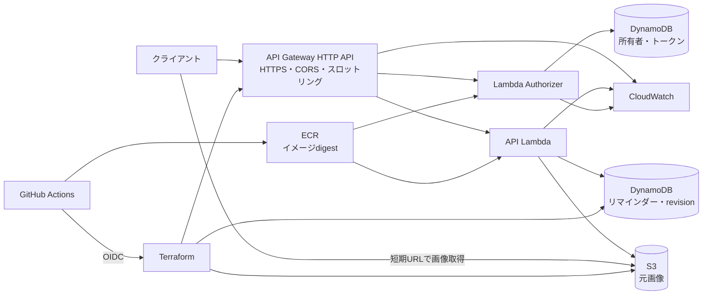

# reminder-server AWS移行・改善設計

作成日: 2026-10-02

状態: ユーザー指定のAWS/GitHub Actions/Terraform構成を具体化したレビュー対象。画像の短期URLを含む新しいAPI契約は提案段階。設計書・実装計画の承認前に製品変更やAWSへの構築を行わない。

監査資料: [リポジトリ監査](../../repository-audit-2026-10-02.md)

置き換える旧案: [SQLite・専用ワーカー案](2026-10-02-reminder-server-modernization-design.md)

## 1. 目的・最新の指示・範囲

WebPageReminderの保存サーバーについて、監査の改善点を対象範囲内で全件扱う。所有者の識別、端末間の更新競合、入力検証、画像の保全、障害時の復旧、配布・運用・文書の整合を満たす。

最新のユーザー指示はAWSのLambda、API Gateway、S3、DynamoDB、CloudWatch、ECRを使用し、CI/CDはGitHub ActionsとTerraformで再検討すること。これにより、以前のSQLite採用方針をDynamoDB/S3へ置き換える。Caddyは使用しない。

維持する制約と方針は次のとおり。

- .devcontainer配下のファイルは一切変更しない。
- READMEを更新し、CLAUDE.mdを新規作成する。AGENTS.mdからの既存参照を修復する。
- 元の画像バイト列を保持する。圧縮・リサイズ・形式変換による置き換えを行わない。
- 所有者認証、項目単位API、revisionによる競合検出、旧JSONの明示的な移行を維持する。
- TypeScriptとCommonJSを維持し、esbuildによるバンドルを採用案とする。難読化は追加しない。
- クライアントのソースはこのリポジトリにないため、API・画像取得・オフライン表示の変更仕様を提供する。クライアント実装そのものは対象外。

IAMはサービス間アクセスとGHAの認証に必要なAWS基盤として含める。独自ドメイン、Cognito、CloudFront、WAF、SNS、VPC/NAT、EventBridgeは標準構成に追加しない。独自ドメインが必要になった場合はACM等を含む追加設計を行う。最初の公開URLにはAPI GatewayのAWS管理ドメインを使用する。

今回行うのは設計と、それに基づくリポジトリ変更の準備である。実際のAWSリソース作成、ECRへのpush、GHA実行、デプロイ、データ取り込みは、この段階で実施しない。

## 2. 推奨構成と比較



API GatewayはHTTP APIを推奨する。認証とCORSを持つ小さなCRUD APIに合わせる。REST APIは、Gatewayによる入力検証、クライアント単位のusage plan、WAF、カスタムGatewayエラー等が必要な場合の代案とする。HTTP APIにも通常のREST形式のルートを定義できる。

Lambdaは通常のオンデマンド実行で、ECR上のコンテナイメージを使う。API用と認証用の2関数を同じイメージから作成し、それぞれ別handlerと実行ロールを指定する。DBワーカー、常駐HTTPサーバー、証明書監視は廃止する。初期構成でExpress互換アダプターは追加せず、API Gatewayのイベントを直接扱う。

| 選択肢 | 判断 |
| --- | --- |
| HTTP API + Lambdaコンテナ + DynamoDB/S3 | ユーザー指定と一致し、常駐サーバー・TLS・DBファイル管理を外せる。採用案 |
| REST API + 同じバックエンド | Gateway側の高度な保護・管理が必要な場合の代案。今回はその追加要件がない |
| LambdaのZIP配布 | この小さなJSサービスでも成立するが、ECR使用という指定に合わせてコンテナを採用する |

DynamoDBは単一リージョンのオンデマンド容量とする。S3とDynamoDBはIAM認証を用いてサービスのエンドポイントに接続し、標準構成ではLambdaをVPCに入れない。マルチリージョン・Global Tables・分散ロック・キャッシュサービスは追加しない。

## 3. コンポーネント・設定・環境

| コンポーネント | 責務 |
| --- | --- |
| API handler | HTTPイベントの検証、操作への振り分け、JSON応答。listenしない |
| Authorizer handler | Bearerトークンと所有者状態の検査、認証済みownerIdをGateway contextへ返す |
| サービス処理 | 入力、所有者境界、revision、日時、画像、容量の契約 |
| DynamoDB repository | 所有者条件のあるQuery/Get、条件付き更新、トランザクション |
| S3 repository | 元画像の保存、versionId・checksum、取得URLの署名 |
| 管理CLI | 所有者・トークン、移行、検査、清掃、復旧の操作。AWSの短期認証を使用する |
| Terraform | state基盤、IAM、ECR、保存・ログ・関数・Gateway等の構成を管理する |
| GHA | 検証、ビルド、イメージ登録、Terraform plan/apply、smoke、清掃 |

環境はdevとproductionを分離し、テーブル・画像バケット・関数・ログ・Terraform stateを別にする。1つの環境のテスト・清掃が他環境のデータを扱わない。AWSアカウントは入力として指定し、既存環境を探索して自動流用しない。

aws_regionは必須入力とし、東京リージョン等に勝手にリソースを作成しない。GitHubのowner/repository、OIDC subject形式、デプロイ環境、AWSアカウント、イメージdigest、許可originも明示的な入力とする。これらを未設定のままapplyしない。

Node.js 24のAWS Lambda公式ベースイメージを使用する。ベースイメージのdigestとnpm依存を固定し、実装時点で更新状況を確認する。.devcontainerのNodeは変更しない。

初期値はAPI Lambdaのメモリ512 MiB、timeout10秒、reserved concurrency10、Authorizerのメモリ256 MiB、timeout5秒、reserved concurrency10とする。API Gatewayのintegration timeoutはAPI Lambdaより長い15秒、stageのスロットリングは20 requests/second、burst40とする。実測で調整し、これらを性能保証値とは説明しない。reserved concurrencyを設定できるアカウント上限も初期構築で検証する。

## 4. 所有者認証と入力境界

前案の所有者ごとの乱数トークンを維持する。管理CLIから所有者を作り、トークン発行・個別失効・ローテーションを行う。ユーザー登録画面や外部IDプロバイダーは追加しない。DynamoDBにはSHA-256ハッシュのみを保存し、平文は発行時の管理操作で一度だけ表示する。

AuthorizerはAuthorization: Bearerを検査し、トークンと所有者を強い整合性で読み取る。キャッシュTTLは0とし、失効がキャッシュに残る構成を初期状態にしない。認証用ロールはidentityテーブルの必要な読み取りとログだけを許可し、リマインダーや画像の書き込み権限を持たない。

API handlerは、所定Gatewayから来たイベント形式とauthorizer contextを検証し、contextのownerIdを使用する。本文のkeyやownerIdを保存範囲として使用しない。API Gatewayのinvoke権限は対象API・stage・aliasに限定し、Lambda Function URLは作成しない。管理CLIとCIのIAMロールは利用者トークンとは別の認証である。

HTTP APIにはAPIキーを利用者認証として追加しない。入力スキーマとメディア型はLambdaで検証する。Authorizerにより不正認証のAPI Lambda起動を抑え、handlerでもJSON解析前に本文サイズを検査する。

接続元IPはGatewayのrequestContextを使用し、クライアントのX-Forwarded-Forを認証やレート制限の根拠にしない。旧ALLOW_DOMAINとリクエストごとのDNS解決を廃止する。既定の追加IP制限は設けず、必要な場合は明示したリテラルの許可設定を用いる。

Gatewayのstage/routeスロットリングは全体の保護であり、利用者ごとの厳密な上限やコスト上限ではない。認証済み所有者にはDynamoDBの条件付きカウンターで1分120リクエストの既定制限を設ける。時間窓と所有者ごとのキーを使用し、期限切れカウンターをTTLで清掃する。TTLの削除時刻を認証や制限解除の条件にはしない。Lambdaメモリ内のカウンターだけで分散した実行を制御しない。

時間窓はサーバー時刻のUTC分境界で区切る固定窓とする。画像URL発行も含む認証対象のv2リクエストを数え、同じ所有者の全トークンで共有する。カウンターを条件付きで加算できた120件までを許可し、121件目以降は保存操作へ進まず429とcode `OWNER_RATE_LIMIT_EXCEEDED`を返す。`Retry-After`は次の分境界までの秒数を切り上げた整数で、最低1秒とする。固定窓は境界前後にリクエストが集中し得る方式であり、任意の連続60秒で120件という保証ではない。

レート上限到達、カウンター処理自体の一時障害、保存容量上限は別の応答にする。カウンターへアクセスできない場合は制限を無視して保存せず503とする。クライアントの対処とGateway自身の429との差を§7で定義する。

## 5. DynamoDBの保存モデルと競合

| テーブル | 内容 |
| --- | --- |
| reminders | ownerIdをpartition key、idをsort keyとする。属性、revision、日時、画像参照、削除状態を持つ |
| identities | 所有者プロフィール、トークンハッシュ、所有者の件数・画像容量、レートカウンター、初回移行の公開状態。種類を区別したキーで保持する |
| image_jobs | 画像IDをpartition key `jobId`とし、所有者、オブジェクトキー、versionId、状態、作成・更新時刻を保持する。期限検索用のsparse GSI `cleanup_by_due`を持つ |

画像そのものやBASE64をDynamoDBへ保存しない。画像の参照はimageId、S3のkey、versionId、MIME、デコード後サイズ、SHA-256を持つ。ユーザー入力のURLをS3キーにせず、サーバーが所有者IDと乱数から生成する。

作成はattribute_not_exists条件、更新は存在・有効状態・revision一致の条件で保護する。revisionは1から開始する。古いrevisionを自動的に上書きしない。GetItemと一覧のベーステーブルQueryはConsistentReadを使用し、通常APIにScanを使用しない。

件数・画像容量が変わる操作は、リマインダーの条件付き更新、所有者のカウンター、画像状態の変更をTransactWriteItemsでまとめる。1項目を同じトランザクション内の複数アクションで扱わない。条件違反、transaction conflict、スロットリング、予期しないエラーを区別する。内部の再試行は同じClientRequestToken・画像参照・期待revisionで行い、実行時間内に収まる回数に制限する。結果が不明な書き込みを新しい操作として無条件に再送しない。

削除はrevisionを照合し、内容と画像参照を除去してid・ownerId・revision・deletedAtだけを残す。削除済みIDの再利用を拒否する。これは古いクライアントの再送による復活を防ぐための記録で、削除復元APIではない。

一覧はidの順序でQueryする。削除記録は応答から除外するが、評価したキーを含むLastEvaluatedKeyをカーソルへ反映する。空のitemsとnextCursorが同時に返る場合もクライアントがページングを継続できる契約にする。1回の読み取り量を制限し、削除記録を飛ばすための無制限なQueryループをしない。複数ページ全体のスナップショットは保証しない。

### 画像清掃の検索キー

`cleanup_by_due`はpartition key `cleanupPartition`、sort key `cleanupSortKey`、projection `KEYS_ONLY`とする。pending・retired・deletingのjobだけに両属性を持たせ、committed・doneからは除去する。`cleanupPartition`は`<state>#<shard>`で、shardは画像IDのSHA-256から決める00〜03の4分割とする。`cleanupSortKey`は13桁にゼロ埋めした期限のepoch millisecondsと画像IDを`#`で連結する。キーの生成方法は共通関数として固定する。

pendingの期限は作成から24時間後、retiredの期限は**retiredへ移した時刻から24時間後**とする。deletingの期限は20分の処理leaseの満了時刻とし、中断した清掃を拾う。状態と索引属性の変更は同じベース項目の書き込みで行い、画像commit等のトランザクションに含める。

清掃CLIは12個のstate/shardについて、partitionの等価条件と`cleanupSortKey < <今回開始時刻を13桁化>#~`のKeyConditionExpressionでQueryする。画像IDはサーバー生成のASCII UUIDに限定するため、同じmillisecondのIDもこの上限で取得できる。GSIの読み取りは結果整合性であり、候補取得だけで削除を決定しない。primary itemの現在状態・期限・leaseを条件付き書き込みで再確認する。通常の清掃にテーブルScanやS3バケット全体の列挙を使用しない。

1ページのLimitは50候補。各partitionを1ページずつround-robinで巡回し、大量のpendingによってretired/deletingが後回しになり続けることを防ぐ。巡回位置と、全候補の処理・条件不一致による見送りを終えたページのLastEvaluatedKeyだけを、state/shardごとに清掃checkpointへ保存する。ページ途中で終了した場合はそのページの開始cursorを保持して再取得し、未処理候補を飛ばさない。再取得で既処理候補が見えても状態条件で見送る。checkpointはimage_jobs内の専用項目に置き、GSIのキーを付けない。末尾へ到達したpartitionはその実行では終了とし、全12個が終了したら清掃を終える。末尾まで進んだcursorは次の実行でリセットし、索引への遅延反映や過去期限の新しい候補も取得する。空のQueryを繰り返して実行時間を使い切らない。checkpoint更新も保守ロールの限定権限に含める。

## 6. 画像保存・取得・失敗時の整合性

### 保存

画像はS3の非公開バケットへ元のバイト列で保存する。Block Public Access、暗号化、TLSを要求するバケットポリシー、versioningを有効化する。API role以外への公開読み取り権限を付けない。

既存のクライアントが画像をBASE64で扱っていることに合わせ、作成・更新の入力では1件のthumbnailとしてBASE64またはdata URLを受け付ける。API Lambdaが形式、サイズ、MIME、checksumを検証してデコードする。初期構成でS3への直接アップロード用の複数段階APIは追加しない。

1. 入力全体を検証し、乱数の画像IDと追跡レコードを作る。
2. S3へ新しい固有キーで保存する。既存画像を同じキーで上書きしない。
3. S3のversionIdとchecksumを記録する。
4. リマインダー、所有者容量、画像のcommitted状態をDynamoDBトランザクションで更新する。画像を差し替えた場合は旧画像を清掃対象にする。
5. DynamoDBが変更を拒否した場合は現在のリマインダーを変更せず、未参照画像を清掃対象として残す。commit結果が不明な場合は画像jobと項目を強い整合性で照合し、committed画像を誤って清掃対象にしない。

S3とDynamoDBを跨ぐトランザクションは存在しない。そのため「完全に同時に保存される」と説明しない。クライアントに見える参照の切り替えはDynamoDBの成功時のみ行い、S3だけ成功した状態を追跡・清掃する。

image_jobsはpending、committed、retired、deleting、doneを区別する。GHAの定期保守ジョブが§5のGSIから期限を過ぎたpending・retiredとlease切れのdeletingを取得する。条件付きでdeletingへ移し、実行IDと20分のleaseを記録する。APIの画像commit条件はpendingと一致しなければ失敗する。これにより清掃中の画像が新しく参照されない。完了への更新にも実行ID・状態の条件を付ける。再実行できる処理とし、Lambdaのreturn後に未awaitの清掃を続ける設計にしない。

CLIの1回の上限は評価した候補10,000件、S3削除操作5,000件、経過10分のいずれかを満たすまでとし、並行処理は最大4件とする。上限到達ではcheckpointと未処理ありの結果を記録し、次の日次実行または手動実行へ継続する。これらは清掃の完了時間を保証する値ではなく、未処理の長期滞留を監視して頻度・上限を調整する。GHAも環境ごとに清掃を直列化する。

削除操作は§8と同じく固有キーへのdelete markerの作成とし、復旧期間内の画像versionを清掃CLIから永久削除しない。再実行時はそのキーの状態を照合し、既にmarkerがある場合もdoneへ収束させる。非現行versionの期限切れは60日保持のLifecycleで扱う。10分の期限に達する前に新しい処理の開始を止め、実行中のAWS操作を短い期限で終了させてcheckpointを保存する。

追跡レコードがversionIdを記録する前に保存処理が停止した場合は、清掃CLIが生成済みキーを照合して処理する。通常の利用者が任意のS3キーを清掃対象に指定できないようにする。

### 取得URLの提案と有効期限

取得は、認証済みAPIが現在参照する画像だけにS3のGET署名付きURLを発行し、クライアントがS3から取得する案を推奨する。URLの要求有効期間は15分とし、実際には署名元の短期AWS認証の有効期限によって短くなる場合も扱う。URLをDBやログに保存しない。

リマインダー本体のJSONは永続する画像IDと属性だけを持つ。短期URLは別の認証対象エンドポイント`GET /v2/reminders/{id}/thumbnail-url`から発行し、`url`、`expiresAt`、`imageId`、`revision`を返す。URL発行はリマインダーのrevisionを更新しない。この応答には`Cache-Control: no-store`を付け、本体のETagを流用しない。`expiresAt`は要求有効期間の終了目安であり、署名元認証の期限等による早期失敗もクライアントが扱う。

URL発行時は所有者の現在の項目を強い整合性で読み、現在参照するkey/versionIdだけを署名する。項目が存在しない・削除済みなら404 `REMINDER_NOT_FOUND`、画像なしなら404 `THUMBNAIL_NOT_FOUND`とする。クライアントは返されたimageId/revisionと手元のメタデータを照合し、異なる場合は本体を更新してから表示を切り替える。取得URLは永続IDではなく、クライアントはowner/id/revision/imageIdと必要な画像バイト列を永続化する。URL期限切れ時はこの専用APIで再発行する。

- 画像の読み込み済み表示がURL期限で直ちに消えるとは限らないが、再読み込みや新しい取得は失敗し得る。
- オフライン表示にはURLではなく、取得した画像バイト列をクライアント側に保存する。
- 同じimageId/checksumの取得済みバイト列は再利用し、未取得画像だけを必要時に取得する。一覧から全画像のURLを無条件に一斉発行しない。
- 画像取得失敗時は認証を確認し、一度APIから再取得してから画像取得を再試行する。失敗を無限に再試行しない。
- URLはそれを知る者が期限内にアクセスできる情報として扱う。トークン失効後も発行済みURLが短期間有効であり得ることを文書化する。
- 通常の画像削除後も、versionIdを含む発行済みURLが期限まで取得できる場合がある。短期URLを即時失効と同じものとは扱わない。

この契約はクライアントの変更を必要とし、現時点で画像URL方式そのものを承認済みとは扱わない。BASE64返却を維持する場合でも画像保存はS3とし、一覧に全画像を埋め込む方式はLambdaの応答上限に合わせて再設計する必要がある。URL方式の採否はこの設計書のレビューで確認する。

## 7. v2 API・入力・CORS

| メソッド・パス | 動作 |
| --- | --- |
| GET /v2/reminders | items、nextCursorを返す。既定20件、最大50件。画像は永続メタデータだけを返す |
| GET /v2/reminders/{id} | 現在の項目と画像メタデータ、revision、強いETag |
| GET /v2/reminders/{id}/thumbnail-url | 現在の画像の短期URLを発行。200、url・expiresAt・imageId・revision。no-store、本体のETagなし |
| POST /v2/reminders | クライアント指定IDで1件作成。201、Location、作成結果、ETag |
| PATCH /v2/reminders/{id} | If-Match必須で部分更新。200、更新結果、ETag |
| DELETE /v2/reminders/{id} | If-Match必須で削除記録へ変更。200、id・deleted・revision |
| GET /healthz | handler応答確認。秘密情報を含めない |
| GET /readyz | 設定・必要リソースの読み取り・初回公開状態を確認。利用不能時503 |

旧POST/PUT /remindersは410と移行先を返し、旧一覧上書きを実行しない。v2と旧APIの互換期間は設けない。

項目のid、url、title、reminderTime、autoOpen、webPush、createdAt、hiddenを維持し、updatedAtとrevisionを追加する。読み取りのthumbnailは、画像なしならnull、画像ありならimageId、mime、bytes、sha256を持つオブジェクトとする。取得URL・expiresAt・S3のkey/versionIdは本体へ含めない。書き込みのthumbnailはBASE64/data URLの文字列とし、空文字列またはnullを画像なしにする。読み取りDTOと書き込みDTOを別に定義し、取得結果の全項目をそのままPATCHへ送らない。

新規作成のcreatedAt/updatedAtはサーバーが決定し、id、url、title、reminderTime、autoOpen、webPush、hiddenと画像入力を検証する。readonly項目や未知のフィールドを拒否する。PATCHは変更可能なフィールドが最低1つ必要である。

項目のGET/POST/PATCHは共通のserializerで同じUTF-8 JSON本体を生成し、フィールド順・日時表記・nullの扱いを固定する。現在時刻、URL期限、requestIdを本体へ混ぜない。強いETagは`"r<revision>-<JSON本体のSHA-256 hex>"`とする。revisionを変更する更新と表現バイト列の変化を両方検出でき、デプロイでserializerが変わった場合にも同じETagで異なるJSONを返さない。JSONはidentityのcontent codingで返し、`Cache-Control: private, no-store, no-transform`を付ける。一覧全体や画像URL応答に項目のETagを流用しない。

If-Matchは単一の強いETagのみ受け付け、弱いETag・`*`・リスト形式は拒否する。サーバーは現在の項目からETag全体を照合し、そのrevisionをDynamoDBの書き込み条件にも使う。クライアントはETagを不透明な値として保存し、revisionから自作しない。一覧から更新する場合は項目GETでETagを取得する。欠落428、不一致412、存在しない項目404、IDの二重作成・再利用409、型・スキーマ違反422、壊れたJSON400、対応しないメディア型415、容量超過413、所有者レート超過429、過負荷・一時障害503を使う。

| 状況 | ステータス・code | ヘッダーとクライアントの対処 |
| --- | --- | --- |
| 所有者の分単位上限到達 | 429 `OWNER_RATE_LIMIT_EXCEEDED` | `Retry-After: <整数秒>`必須。指定秒数とjitterを待ち、回数を制限して再試行する |
| 所有者の件数・画像合計上限 | 413 `OWNER_STORAGE_LIMIT_EXCEEDED` | 自動再試行をせず、既存データ整理または保存内容の変更を案内する |
| 単体の本文・画像サイズ上限 | 413 `PAYLOAD_TOO_LARGE` / `THUMBNAIL_TOO_LARGE` | 入力を減らす。待機だけでは解消しない |
| 保存先・カウンター等の一時障害 | 503 `SERVICE_UNAVAILABLE` | 回数制限付きbackoff。書き込み結果不明時は先に項目を再取得して照合する |
| Gatewayのstage/route上限到達 | 429、Gatewayのエラー形式 | アプリのcodeやRetry-Afterを保証しない。ヘッダーがなければ回数制限付きbackoffを使う |

所有者429の本文は共通のcode・message・requestIdに`retryAfterSeconds`を追加する。Retry-Afterと同じ秒数とし、保存容量や認証情報を露出しない。レート解除後も古いETagでの更新が412になる場合は最新項目を取得し、競合を処理する。

本文はapplication/jsonのみ受け付ける。JSONエラーは分類したcode、message、requestIdを持ち、入力の実値・SQL・AWS内部エラーを返さない。HTTP API自身が生成する認証失敗・スロットリング・サイズ超過の応答はLambdaのJSON形式と異なり得るため、Gatewayのステータスとエラー形式もクライアント契約に記載する。全ての障害がアプリ独自形式になるとは保証しない。

APIのJSON上限は2 MiB、画像はデコード後1 MiB/項目、所有者は有効項目1000件・画像合計128 MiBを既定値とする。所有者の保存上限はトランザクションで検査する。API Gateway/Lambdaのプラットフォーム上限も別に存在し、画像を埋め込んだ一覧で上限を回避する設計にしない。

idは空でない制御文字なしの最大128文字、URLはhttp/httpsで最大4096文字、タイトルは最大1024文字とする。真偽値の文字列や数値への型強制変換をしない。reminderTimeは実在する日時でZまたはUTCオフセット必須とし、UTCへ正規化する。過去のリマインダーも保存・移行できる。

CORSはAPI Gatewayに集約し、完全なorigin一覧、必要なGET/POST/PATCH/DELETE/OPTIONS、Authorization/Content-Type/If-Match、公開するETag/Location/X-Request-Id/Retry-Afterを設定する。credentialsは無効とする。HTTP APIが未許可originを自動で403にするとは扱わず、CORSのブラウザー制御と認証を区別する。S3の画像GETにも必要なoriginだけのCORSを設定する。OPTIONSはAuthorizerを通さず、CORS応答の振る舞いをAWSで検証する。

## 8. 初回JSON移行と復旧

通常起動で旧JSONを自動変換しない。管理CLIが原本の読み取り、完全な事前検証、旧keyとownerIdの対応付け、画像保存、DynamoDB保存、事後照合を行う。移行の全エラーを、位置とフィールド名・理由で報告し、画像・旧key・URL・タイトルの実値をログへ出さない。

原本は変更・移動・削除せず、作業用コピーを検査する。own propertyだけを扱い、ID重複、日時、BASE64、MIME、容量を検査する。不正項目を黙って捨てたり、曖昧な日時をローカル時刻で補ったりしない。上限を超える既存画像は変換せず中止し、運用者の明示した設定や作業用データで再検証する。

移行先は新規の空環境に限定する。公開状態をfalseにしたまま、移行run IDで記録を追跡し、複数バッチで取り込む。DynamoDBの1トランザクション上限があるため、全JSONファイルを1回のトランザクションで保存できるとは説明しない。失敗時の途中データは未公開のまま、run IDを使って検査・再開または清掃できるようにする。

全所有者の項目数、ID、属性、日時の同一瞬間への正規化、S3画像のバイト列・checksumを照合した後だけ、単一の公開状態レコードを切り替える。公開前のAPIは503を返し、部分移行したデータを通常利用できない。既存データのある稼働環境へ上書き移行しない。

移行したcreatedAtとIDは保持し、updatedAtはcreatedAt、revisionは1とする。空一覧の所有者も保持する。旧keyからトークンを生成せず、所有者に新しいトークンを発行する。

切り戻しは新環境への書き込み開始前なら保全した旧JSON・旧サーバーを使用できる。新環境で書き込み開始後に旧JSONへ戻すと変更が失われるため、AWSデータの復旧を使用する。二重書き込みはしない。

DynamoDBはPITRを有効化し、復旧期間を35日とする。S3はversioningで各参照のversionIdを保持し、不要画像はdelete markerによって現行取得から外す。非現行画像バージョンは60日保持し、復旧期間より先に削除しない。使用中の現行オブジェクトを経過日数だけで期限切れにしない。

PITRはS3と同一時点の原子的なバックアップではない。復旧は新しいDynamoDBテーブルへ行い、画像versionId、所有者、トークン、件数・容量、未完了画像処理を照合してから参照先を切り替える。復旧先が参照する非現行versionは元バイト列のまま新しい固有キーの現行versionへコピーし、復旧先の参照とjobを更新してLifecycleの期限切れ対象から外す。トークン失効状態も復元されるため、必要な失効を再適用する。Terraform state復旧、アプリのイメージ切り戻し、利用者データの復旧は別の手順とする。

## 9. Terraformの責務と初期構築

Terraformは設定を管理し、docker build、ECR push、移行データ・トークン作成をlocal-execで実行しない。

| 構成 | 管理するもの |
| --- | --- |
| infra/bootstrap | state用S3、OIDC provider、GHAロール、ECR。初回の認証基盤 |
| infra/platform/envs/dev・production | 保存テーブル、画像バケット、実行ロール、CloudWatch。データと観測の基盤 |
| infra/application/envs/dev・production | Lambda、公開version・alias、API Gateway、ルート・Authorizer・invoke権限 |

bootstrapだけ最初に既存の短期管理認証で実行し、state用バケット作成後にそのstateをS3へ移行する。以後はGHAのOIDCを使用する。初期認証にAWSアカウントのrootや長期アクセスキーを前提としない。

順序は「bootstrap → platform → イメージ登録 → application」とする。ECRに実イメージがない状態でLambdaを作る循環依存を避ける。日常更新でbootstrapを繰り返し変更しない。IAM/OIDCの既存リソースがある場合は、明示されたimport等で管理し、名前だけで上書きしない。

state用S3は画像バケットと分け、versioning、暗号化、Block Public Access、限定したIAMを設定する。stateのロックはS3のuse_lockfileを使用し、deprecatedのDynamoDBロックテーブルは追加しない。環境・構成ごとにstate keyを分ける。

TerraformとAWS providerのバージョン制約、.terraform.lock.hclを管理する。state、plan、.terraform、認証ファイルをGitに含めない。stateやplanに機密情報が含まれ得るため、公開ログやPRコメントへそのまま出力しない。トークンの平文をTerraformの変数・outputへ入れない。

データテーブルとS3バケットは削除保護・prevent_destroyを設定し、S3 force_destroyは無効にする。通常のCI/CDにterraform destroyを含めない。これは全ての削除経路を防ぐ万能の保証ではなく、意図しない変更を計画段階で止めるための境界である。

### 公開URLの維持条件と置換防止

環境ごとにHTTP APIを1つ保持し、stage名は`$default`に固定する。公開ベースURLは`https://<api-id>.execute-api.<region>.amazonaws.com`となる。URLが維持される条件は、同じAPI ID・リージョン・stage・有効なexecute-api endpointを保持することである。ルート・integration・Lambda aliasの通常更新は既存APIへ適用する。APIの削除・再作成や別リージョンへの移転では新しいURLとなり、アプリ名を同じにしても元のID/URLは復元できない。[HTTP APIのstageとURL](https://docs.aws.amazon.com/apigateway/latest/developerguide/http-api-stages.html)

productionの`aws_apigatewayv2_api`と`aws_apigatewayv2_stage`に`lifecycle.prevent_destroy = true`を設定する。API本体へcreate_before_destroyを付けて置換してもURLは引き継げない。Terraformのresource/moduleアドレス整理はmoved blockを使い、既存APIを管理へ取り込む場合は明示的なimportで実体を維持する。

prevent_destroyは設定ブロックそのものを削除すると保護がなくなる。そのためGHAは保存したplanのJSONを非公開の処理内で検査し、production APIまたはstageのresource_changesに`delete`を含むactionsがあれば、削除のみ・置換順序の両方を拒否してapplyしない。既存URLと計画後outputの差も確認し、通常リリースでのURL変更を止める。運用中URLがあるのに計画後URLがunknownなら、一致を確認できたものと扱わず通常昇格を止める。新規環境の初回作成は既存URLなしとして区別する。plan検査は§10のproduction昇格条件とする。[Terraform lifecycleの制約](https://developer.hashicorp.com/terraform/language/meta-arguments/lifecycle)

置換が必要な変更は通常リリースから分け、旧・新URL、クライアント設定の更新、並行提供期間、移行後の廃止を具体化して別途レビューする。独自ドメインを採用しない初期構成では、任意のAPI置換後も同じ公開URLを保証することはできない。

## 10. GitHub ActionsのCI/CD

GHAはAWS OIDCを使用し、AWS_ACCESS_KEY_ID等の長期キーをGitHub Secretsへ保存しない。audとsubを対象repository・environmentに限定し、実際のGitHub subject形式を確認する。2026年以降のimmutable subject形式を含め、推測したsubで構築しない。

| workflow | 動作 |
| --- | --- |
| ci.yml | PR/pushでnpm ci、型、lint、振る舞いテスト、esbuild、Terraform fmt/validate、依存監査、イメージbuildとhandler検証。AWSに変更しない |
| deploy.yml | mainの確定コミットでイメージを一度buildし、OIDCでECR登録。digestを使ってdevへplan/applyしsmokeを実施。productionは明示したリリース操作で同じdigestを昇格する |
| maintenance.yml | 日次と手動で画像の未完了・不要記録を清掃し、結果と未完了数を記録する。インフラapply権限は持たない |

untrustedなPRやforkのコードへAWSのデプロイ権限を渡さない。pull_request_targetでPRコードを実行する構成は作らない。AWSへのplanを実行するのは信頼したmainや明示したリリース操作だけとし、PRではAWS認証なしの静的検証を基本にする。

役割はイメージ登録用、Terraform plan用、apply用、保守用を分ける。planでもstateロックのために限定的な書き込み権限が必要であり、完全なread-onlyとは表示しない。applyのiam:PassRoleは所定のLambda実行ロールだけを対象とする。

permissionsはcontents: readを基本とし、AWS認証のjobだけid-token: writeを付ける。外部Actionsを確認済みSHAで固定する。環境ごとにconcurrency groupを使用し、進行中のapplyを新しい実行で途中キャンセルしない。S3 stateロックも有効にする。

productionにはGitHub Environmentのブランチ制限を設定する。利用できる場合は承認規則も設定する。手動リリースに選ぶdigestとplanをレビュー可能にし、保存したplanを同じworkflowのapplyで使用する。planは短い保持期間の非公開artifactとして扱う。main pushだけでproductionへの破壊的変更を実行する構成にはしない。

production applyの前に§9のAPI/stage削除・置換と公開URL変更の検査を必須にし、検査した同じplanだけをapplyする。plan JSONを公開ログへ出さず、検査結果は対象resourceアドレスと変更種別に限定して記録する。

AWSへの初回bootstrapと実際のデプロイは、リポジトリ内の設計・コード・planがレビュー可能になった後の別操作である。この設計段階のツールからGHAやAWSへ実行を送らない。

## 11. ECR・ビルド・最終イメージ

TypeScriptの型検査はtsc --noEmit、JavaScript生成はesbuildで行う。Node.js向けCommonJS、Node24 target、サーバー用handler・authorizer・CLIの複数エントリーを使用する。

AWS SDK v3と検証用などのJavaScript依存も、バージョン固定してアプリへバンドルする案とする。Node組み込み以外の対象パッケージを明示的にbundleへ含め、Lambdaベースイメージ内のSDKの版に依存しない。SQLiteのネイティブアドオンがなくなるため、初期構成ではアプリ用node_modulesを最終イメージへ配置せずに成立するかを成果物テストで確認する。実行時ファイル・動的ロードを必要とする依存を安易に採用しない。

```text
/var/task/
├── dist/
│   ├── api.js
│   ├── authorizer.js
│   ├── admin.js
│   └── *.js.map
└── THIRD_PARTY_NOTICES
```

これはアプリ成果物の配置であり、AWSベースイメージのランタイム内部にもnode_modulesが一切存在しないという意味ではない。CLIは同じ成果物を管理端末やGHAから使用する。API関数のhandlerはdist/api.handler、認証関数はdist/authorizer.handlerとする。

ソースマップを生成し、公開HTTPで配信せず、成果物の版に対応づける。難読化、プロパティ名のmangleは追加しない。APIやAWS SDKのフィールド、ログ、ワーカーのような通信契約を変形する処理を避ける。minifyは初期状態では無効とし、サイズ・起動時間の測定と診断性を基に別途判断する。

Lambdaのコンテナは普通のnode server.jsという常駐起動ではなく、Lambda runtime interfaceを使ってhandlerを呼び出す。公式Node24ベースを使い、AWSが定義する実行ユーザーで必要なファイルを読めるようにする。データをコンテナのファイルシステムや/tmpに永続化しない。

ECRはLambdaと同じリージョンに配置する。イメージのタグはコミットSHAでimmutableにし、Terraformへはtagではなくrepository@sha256のdigestを渡す。Lambdaのversionとaliasを公開し、API Gatewayはaliasを呼び出す。ECRのタグ更新だけでは関数が更新される前提にしない。

イメージは初期構成でlinux/amd64の単一architectureとし、Lambda側もx86_64に揃える。Lambda非対応のmulti-architecture manifestやattestation付きindexを実行イメージとして渡さない。公式手順に合わせてBuildxのprovenanceを実行イメージに付けず、SBOM・ビルド由来情報はdigestと対応する別artifactに保持する。

ECRの保持・清掃は、現在のaliasと切り戻し対象versionが参照するdigestを保持する。単純な最新N件の削除で稼働中Lambdaのイメージを消さない。脆弱性検査と、選んだdigestのhandler検証を公開前に行う。

## 12. ロールバック・観測・運用

アプリの切り戻しは既知の前digestをTerraformへ指定し、version/aliasを更新する。データの削除やテーブル復元を通常のアプリ切り戻しに含めない。schema・APIの変更は、保持する旧versionが既存データを扱える互換性を検証し、破壊的変更は通常デプロイに混ぜない。

切り戻しでも§9の同じAPI ID・リージョン・`$default` stageを保持する。公開URLをTerraform outputと運用台帳に記録し、デプロイ・切り戻しのsmokeで一致を確認する。API本体を削除した後は前のイメージやstateを戻すだけでは以前のURLを復元できず、URL移行として扱う。

CloudWatchはLambdaとAPI Gatewayのログ、エラー、スロットリング、duration、DynamoDBの失敗、画像清掃の未完了数を扱う。ログ保持は30日、構造化JSONでrequestIdとLambda requestIdを対応づける。Bearer、署名付きURL、本文、画像、旧key、AWS認証をログへ含めない。

初期アラームは環境ごとに8個の標準解像度・単一メトリクスのアラームとする。対象はGateway 5xx、API Lambda error/throttle、Authorizer error/throttle、API duration p95が2秒を超える状態、日次清掃の失敗、日次清掃の未完了である。清掃の2指標だけを独自メトリクスとして日次実行で発行し、ownerId/imageId等のdimensionを付けてメトリクス数を増やさない。未完了数は処理上限下で確認できた下限値と未処理ありのフラグを区別し、全テーブルの正確な残件数と表示しない。

少数の呼び出しでのduration評価や無通信期間を誤検知しないよう、期間とmissing dataの扱いを設定する。清掃指標は日次発行に合った期間で評価し、実行されなかった場合も把握できるようにする。API Gatewayのroute別詳細メトリクスは初期状態で無効とする。CloudWatchアラームを作ることとメール通知が届くことは別であり、SNS等の通知先は追加要件として扱う。

LambdaのSDK clientは実行環境で再利用するが、利用者の状態・カウンターをメモリだけに保存しない。全ての必要な保存と追跡記録をawaitしてから応答し、実行環境のfreeze後もバックグラウンド処理が継続するとは期待しない。残り実行時間を確認して外部操作の期限を設ける。

本番のdocker-composeは不要になる。ルートComposeを残す場合は、Lambda Runtime Interface Emulator、DynamoDB Localなどのローカル検証用途だけとし、本番の永続化・TLS手順として案内しない。.devcontainerは変更しない。ローカルテストの模擬S3だけでIAM、署名、Gatewayの動作を検証済みとは扱わず、dev環境のsmokeに実サービスでの確認を含める。

### この構成の費用試算

Authorizer TTL 0では、正常な認証対象APIが月100万回ならAuthorizerを含むLambda呼び出しは約200万回になる。画像URL発行と、If-Match取得のための項目GETもAPI回数に含める。DynamoDBはトランザクション内の各項目が通常の2倍の容量を使うため、所有者カウンター・画像jobを含む項目数とGSIへの書き込みも見積もる。認証の強い読み取り、毎回のレートカウンター、公開状態の読み取り、PITR、旧画像version、清掃、ログ、アラーム、devを除外した金額をこの構成の月額として使用しない。

リージョン未指定のため、公式料金例を確認できた**US East (N. Virginia)の参考モデル**を置く。東京リージョンの単価とは扱わない。30日/月、1 USD = 150円という説明用の換算、税別、無料枠・クレジットを差し引かない比較である。API平均課金時間300 ms/512 MiB、Authorizer100 ms/256 MiB、画像平均100 KiB、取得0.5回/API、画像変更0.05回/APIを仮定する。devのリクエスト・保存量はproductionの10%だが、アラーム等は独立して維持する。

| productionの認証対象API/月 | production USD | dev USD | 共通ECR・state等 USD | 合計USD | 合計円・税別 |
| --- | ---: | ---: | ---: | ---: | ---: |
| 1万回 | $1.0554 | $0.8615 | $0.2977 | $2.2146 | 約332円 |
| 10万回 | $2.6286 | $1.0189 | $0.2977 | $3.9452 | 約592円 |
| 100万回 | $16.5364 | $2.4096 | $0.2977 | $19.2437 | 約2,887円 |

平均保存量はproductionの有効画像1/5/20 GB、DynamoDBベース3表0.1/0.5/2 GBとし、GSI等、PITR、画像旧version60日分と清掃待ち24時間分を加える。DynamoDBの容量係数は平均6 RRU + 4 WRU/APIの予算モデルで、実際の消費容量や最悪値を保証しない。[単価・全前提・計算式・内訳](../../aws-cost-estimate-2026-10-02.md)に無料枠の条件と未算入項目も記載する。

インターネット転送100 GB/月の無償枠をこのシステムに全て割り当てられる場合、転送分だけを差し引いた同条件の合計は約311/503/2,122円になる。他サービスと共有する枠をdevとproductionで二重に差し引かない。Lambda等の無料枠・クレジットは別途評価する。以前の「月約20／60／380円」はこの設計の試算として流用しない。

構築先リージョンが決まったら地域別単価へ更新し、devの実測でduration・ConsumedCapacity・画像version・転送・ログ・ECRを再計算する。GHAの有料実行時間・artifact、復旧・初回移行、追加KMS/通知/検査等はこの通常月の表へ含めていない。VPC/NATやProvisioned Concurrencyは初期構成に追加しない。示した金額を実請求や費用上限の保証とは扱わない。

## 13. 品質・依存・文書・秘密情報

strict、noUncheckedIndexedAccess、exactOptionalPropertyTypes、noImplicitReturnsを使用し、esbuildに合わせたisolatedModulesも検証する。イベント、Authorizer context、CLI入力、DynamoDB応答を実行時に検証する。型情報のあるlint、Promiseの未処理、Node globals、生成物の除外を設定する。

使用しなくなるExpress、cookie-parser、morgan、helmet、chokidar、tsup、better-sqlite3関連の案、alias解決用依存などを見直す。Expressとhelmetを外す場合も、CORS・メディア型・キャッシュ・必要な応答ヘッダーをHTTP契約として明示し、ライブラリ削除だけで保護があるとは説明しない。

npm ci、依存更新、ロック整合性、実行・開発依存の脆弱性検査、AWS SDKの版固定、Terraform provider lockを整備する。Dependabotはnpm、GitHub Actions、ルートDocker、Terraformを対象にし、.devcontainerは除外する。

READMEはAWS構成、ローカル検証、AWS認証、初回bootstrap、日常デプロイ、planのレビュー、ロールバック、トークン管理、APIの完全な例、短期画像URLとオフライン表示、JSON移行、復旧、費用要因を記載する。

CLAUDE.mdを新規作成し、AGENTS.mdの既存symlinkを維持してリンク切れを解消する。用途、構成、コマンド、必要な検証、AWS境界、データ原本保全、revision、画像バイト列、.devcontainerの除外、秘密情報を読まない規則、ユーザー指定のContext7手順を含める。未実装のコマンドを利用可能と記載しない。

ルートClaude/Codex設定とシェルガードを公式に対応した形式で整備し、模擬入力で対象漏れを検証する。未対応hookがあれば動作すると表示せず、実際の権限設定と指示へ置き換える。正規表現だけを完全な隔離機構とは扱わない。

追跡済み.env.actionsとreminders.jsonは内容を読み出さず、ローカルファイルを保持して追跡から外す。秘密設定、state、plan、DB、画像、バックアップをignoreし、公開テンプレートだけを区別する。Git履歴改変、AWS認証の読み出し、秘密値の自動ローテーションは行わない。

## 14. B01〜B06とF01〜F32の扱い

| 候補 | AWS版での扱い |
| --- | --- |
| B01 | 採用。所有者トークン、Authorizer、項目単位API |
| B02 | 採用。revision/If-MatchとDynamoDB条件付き書き込み。旧API互換期間なし |
| B03 | 採用。DynamoDBトランザクションとS3。S3との跨サービス原子性はなく、追跡・清掃・復旧で扱う |
| B04 | 部分採用。日時契約を明示する。削除復元APIは今回の提案範囲に含めない。PITRは運用上の復旧であり、利用者のUndoとは別 |
| B05 | 採用。TLSをAPI Gatewayへ委譲する。Caddy、直接TLS、証明書監視は不要 |
| B06 | 採用案。tscによる型検査とesbuildによるLambda成果物生成。難読化なし |

| ID | 対応と検証の焦点 |
| --- | --- |
| F01 | 入力スキーマ、個別API、不正入力でメタデータを変えない |
| F02 | revision/If-Match、条件付き更新、同時更新・別項目保存 |
| F03 | ownerIdを認証から取得、DynamoDBキーの検証、移行はown propertyだけ |
| F04 | Terraformによる保存先作成、空一覧200、設定・公開状態の検証 |
| F05 | Authorizerと所有者境界。Gateway公開やAWS IAMを利用者認証の代わりにしない |
| F06 | 認証前段、本文・画像・保存容量、Gateway throttling、所有者counter、concurrency |
| F07 | DNS/IPフィルターを廃止、GatewayのsourceIp、任意の明示IP制限 |
| F08 | Gateway/S3のCORS、完全origin、preflight、メソッド・ヘッダーの整合 |
| F09 | JSON DTO・メディア型、Gateway由来エラーの区別、画像取得契約 |
| F10 | 分類したエラー、CloudWatch、requestId、機密値をログに含めない |
| F11 | ファイルの直接書き込みを廃止、DynamoDB条件・transaction、PITR、S3 versioning |
| F12 | 全JSON同期読み書きを廃止、所有者Query・ページング、画像はS3 |
| F13 | 自前証明書更新を廃止、GatewayのTLSと実際の公開経路を検証 |
| F14 | 自前cert.pem配布を廃止、Gatewayの証明書経路を確認 |
| F15 | 本番Compose前提を廃止、Terraform初回順序、ECR/Lambda/保存のsmoke |
| F16 | 常駐サーバー・監視を廃止、Lambdaで必要な保存をawait、timeout・再送を扱う |
| F17 | health/ready、dev smoke、CloudWatchの障害状態・アラーム |
| F18 | Lambdaの実行ユーザー・IAM、read-only成果物、memory/timeout/concurrency。ホストコンテナのresource前提は置き換える |
| F19 | npm ci、dockerignore、Lambda base digest。devcontainer内のglobal tool固定は除外 |
| F20 | 未使用依存削除、npm lock更新、AWS SDK固定、npm/ECR検査 |
| F21 | Lambda・CI・packageの更新済みNode24。devcontainerのNode25 EOLは対象外で残る |
| F22 | tsupからesbuildへ移行、Lambda handler成果物と複数entryの検証 |
| F23 | PRの型/lint/test/build/Terraform検証、dev実サービスsmoke、昇格前確認 |
| F24 | Action SHA、OIDCとjob最小権限、state lock、dependabot、apply直列化 |
| F25 | dist/生成物・.devcontainerをlintから除外、Node globals、統一コマンド |
| F26 | 追加strict設定、イベント・context・DBの検証、型情報lint |
| F27 | ルートpackage/README/ローカル検証を整備。devcontainerの認証必須初期化とARM固定は除外 |
| F28 | 全体が.devcontainer配下にあるため対象外。firewallの指摘は残る |
| F29 | 全体が.devcontainer配下にあるため対象外。第三者proxyの指摘は残る |
| F30 | ルートの秘密ファイル規則・ガード・追跡を整備。devcontainer内は除外 |
| F31 | README/AWS運用/CLAUDE.md新規作成、AGENTS.md参照修復 |
| F32 | handler・サービス・保存・CLIを分離、未使用依存削除、診断成果物 |

旧構成がなくなることで解消する項目と、新しい実装で修正する項目を完了報告で区別する。対象外や未検証を修正済みとは扱わない。

## 15. 検証・受け入れ条件

- API: 必須値、型、未知フィールド、メディア型、日時、BASE64、MIME、サイズ、空一覧、cursor、ETag、If-Match、旧API410を検証する。
- ETag: 同revisionの項目を繰り返しGETした本文と強いETagの一致、画像URL再発行後も本体が不変であること、本文の表現が変わればETagが変わること、弱いETagで更新できないことを検証する。
- 所有者: 不正・失効トークン、別所有者、context欠落、直接invoke、画像URLの発行対象を検証する。
- レート: 同じ所有者の複数トークンを使った並行120件の上限、121件目の429/code/Retry-After、UTC分境界、カウンター障害時503、容量413との区別、CORSによるRetry-After公開を検証する。
- 競合: 同revisionの同時更新で1件だけ成功、別項目保持、二重作成、削除後の復活防止、カウンター整合を検証する。
- 画像: 元のバイト列・checksum一致、S3成功後のDynamoDB失敗、timeout、不明なcommit結果、清掃とcommitの競合を検証する。
- 清掃: GSIへの遅延反映、retiredから24時間の猶予、期限検索と公平な巡回、複数ページ・ページ途中の再開、候補/削除/時間の上限、lease切れの再開、commit済み画像を削除しないこと、delete markerと60日保持の整合を検証する。
- URL: 期限切れ時の再発行、S3 CORS、発行済みURLと失効・削除の関係を確認する。クライアントのオフライン処理は要求仕様として明示し、未実装のまま検証済みと言わない。
- 移行: 複数所有者、空一覧、特殊キー、壊れた入力、バッチ途中失敗、再開、公開gate、原本不変、画像一致を合成データで検証する。
- 復旧: dev環境でPITR等から新テーブルへ復元し、S3 versionId、トークン、カウンター、画像jobを照合する。単に設定を有効にしただけで復元検証済みとは扱わない。
- ビルド: npm ci、型、lint、test、esbuild、複数handler、ソースマップ、third-party notices、Lambda runtime emulatorを検証する。
- IaC: fmt/validate、provider lock、計画の対象、state lock、IAM trust/PassRole/invoke範囲、画像・stateの非公開、削除保護、環境分離を確認する。
- URL維持: API/stageのdelete-only・両順序のreplacement・設定ブロック削除を模擬planで拒否すること、初回作成とunknown outputの区別、moved/importによる実体の維持、通常更新・切り戻し後の公開URL一致を確認する。
- CI/CD: ECR実digest、Lambda version/alias、dev smoke、同digest昇格、前digestへの切り戻し、applyの直列化、未信頼PRへの権限不付与を確認する。
- 運用: CloudWatchのログ・保持・アラーム、秘密値を記録しないこと、清掃再実行、AWS上のtimeout/throttleを検証する。
- 文書: 実行コマンドとAPI例、CLAUDE.md、AGENTS.md参照、AWSとローカルの違い、短期URL・データ復旧を照合する。
- 費用: 認証APIの2倍のLambda回数、トランザクションの項目別容量、レートcounter・GSI・PITR・旧version・観測・devの算入、換算・合計、地域別単価と無料枠の条件を照合する。未実測の係数を実測値と表示しない。
- 除外: git diffで.devcontainer配下の変更がないことを確認する。

AWSで実行する検証は専用devリソースと合成データを使う。この段階の設計作業では実施しない。ローカルの模擬や計画レビューと、実AWSで確認済みという主張を分ける。権限・環境が未提供の検証は未実行として報告する。

## 16. 設計のレビューと次の段階

AWS採用の指示に基づいてこの設計書をレビュー対象として作成した。既存のSQLite案への承認を、AWS上の構築や画像の新しいクライアント契約の承認へ拡張しない。

ユーザーがAWS版設計書を承認した後、writing-plansでリポジトリ変更の実装計画を作成する。画像URL契約、B04の部分採用、HTTP APIの選択、ECRの配布方式、CI/CDの本番昇格もこのレビューに含める。計画のレビューと実行方法の選択後に製品変更を開始する。

## 17. 確認した一次資料

- [API Gateway: HTTP APIとREST API](https://docs.aws.amazon.com/apigateway/latest/developerguide/http-api-vs-rest.html)
- [API Gateway: Lambda Authorizer](https://docs.aws.amazon.com/apigateway/latest/developerguide/http-api-lambda-authorizer.html)
- [API Gateway: HTTP API throttling](https://docs.aws.amazon.com/apigateway/latest/developerguide/http-api-throttling.html)
- [API Gateway: HTTP APIのstageと公開URL](https://docs.aws.amazon.com/apigateway/latest/developerguide/http-api-stages.html)
- [RFC 9110: 強い検証子](https://www.rfc-editor.org/rfc/rfc9110.html#section-8.8.1)
- [RFC 9110: If-Match](https://www.rfc-editor.org/rfc/rfc9110.html#section-13.1.1)
- [Lambda: Node.jsコンテナ](https://docs.aws.amazon.com/lambda/latest/dg/nodejs-image.html)
- [Lambda: 制限](https://docs.aws.amazon.com/lambda/latest/dg/gettingstarted-limits.html)
- [Lambda: 実装の推奨事項](https://docs.aws.amazon.com/lambda/latest/dg/best-practices.html)
- [DynamoDB: 大きな属性をS3へ分離](https://docs.aws.amazon.com/amazondynamodb/latest/developerguide/bp-use-s3-too.html)
- [DynamoDB: トランザクション](https://docs.aws.amazon.com/amazondynamodb/latest/developerguide/transaction-apis.html)
- [DynamoDB: GSIと容量・整合性](https://docs.aws.amazon.com/amazondynamodb/latest/developerguide/GSI.html)
- [DynamoDB: PITR](https://docs.aws.amazon.com/amazondynamodb/latest/developerguide/Point-in-time-recovery.html)
- [S3: 署名付きURLと有効期限](https://docs.aws.amazon.com/AmazonS3/latest/userguide/using-presigned-url.html)
- [S3: versioning](https://docs.aws.amazon.com/AmazonS3/latest/userguide/Versioning.html)
- [Terraform: S3 backendとロック](https://developer.hashicorp.com/terraform/language/backend/s3)
- [Terraform: lifecycle/prevent_destroy](https://developer.hashicorp.com/terraform/language/meta-arguments/lifecycle)
- [Terraform: planのJSON形式](https://developer.hashicorp.com/terraform/internals/json-format)
- [Terraform AWS provider: Lambda](https://github.com/hashicorp/terraform-provider-aws/blob/main/website/docs/r/lambda_function.html.markdown)
- [GitHub Actions: AWS OIDC](https://docs.github.com/en/actions/how-tos/secure-your-work/security-harden-deployments/oidc-in-aws)
- [esbuild: Node.js向けバンドル](https://esbuild.github.io/getting-started/#bundling-for-node)
- [この構成の費用試算・料金資料](../../aws-cost-estimate-2026-10-02.md)

実装計画・実装時には対象版の公式仕様を再確認する。AWSアカウント・リージョンのquotaやGitHubの利用プランを、資料にある既定値だけで利用可能と判断しない。
